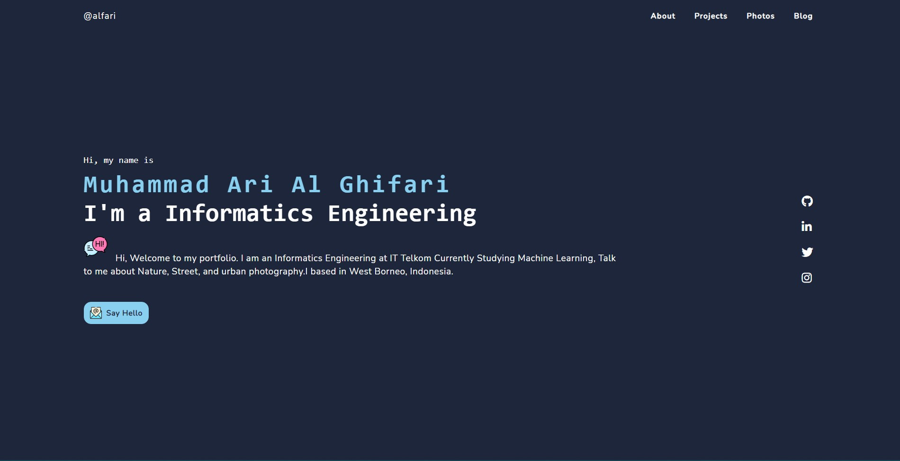

  

  
  
  

# website-personal-portfolio
use as a portfolio website as an addition to your resume or cv

# What's new
I slightly changed the look on the mobile to make it look good and make it simpler in appearance.

and tidy up some html file directories

# follow too
creator : https://github.com/anniedotexe/anniew.xyz
